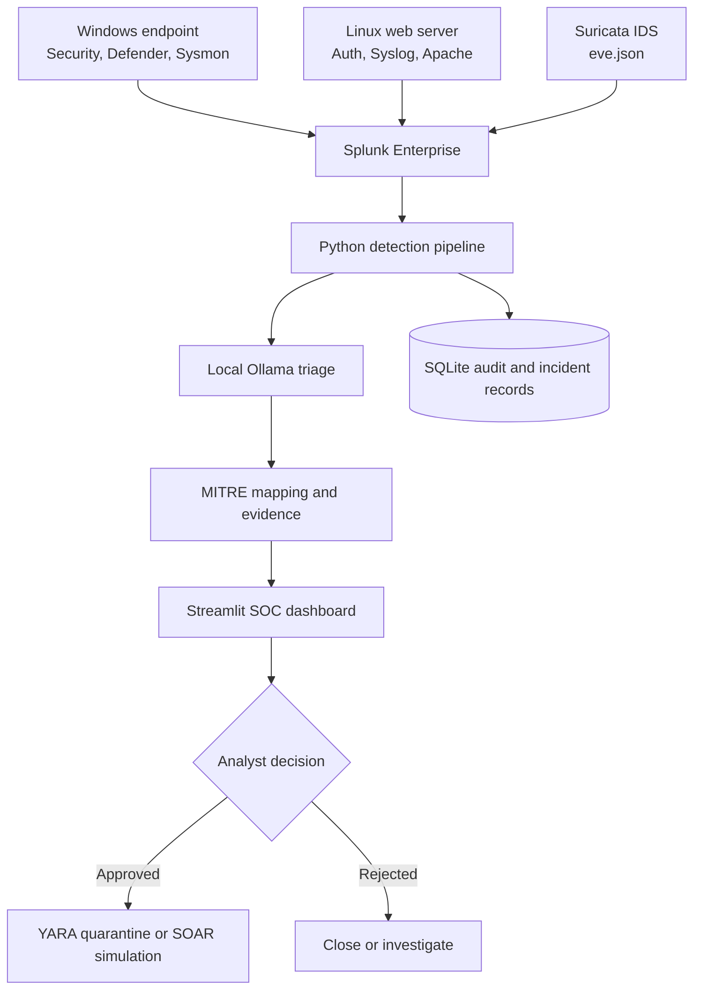

# AI-Augmented SOC Triage Platform

[](https://www.python.org/)
[](https://www.splunk.com/)
[](https://ollama.com/)
[](https://attack.mitre.org/)
[](LICENSE)

An end-to-end, AI-augmented Security Operations Center platform built in an isolated VMware laboratory. It collects endpoint, network, Linux and web telemetry in Splunk; runs automated detections; performs local Ollama-based triage; maps supported activity to MITRE ATT&CK; and provides analyst-controlled response workflows.

> **Project status:** Core platform operational and validated in a private lab. Windows, Linux, Apache, Suricata, YARA, Splunk ingestion, automated triage and dashboard workflows have been tested. This project is aligned with selected ISO/IEC 27001 and NIST practices; it is not an ISO certification or a production security product.

## Why this project exists

Tier-1 SOC analysts often spend significant time collecting context, classifying alerts and documenting repetitive investigations. This project explores how a local language model can assist that process without giving the model unrestricted response authority.

The design follows three principles:

- **Evidence before conclusions:** AI output is supported by the original security event and deterministic mappings.
- **Human approval before containment:** response actions remain analyst-controlled.
- **Local-first AI:** Ollama processes alerts locally without requiring a third-party AI API.

## Architecture



### Lab components

| Component | Role |
|---|---|
| Splunk Enterprise | Central SIEM, search, dashboards and correlation |
| Splunk Universal Forwarder | Windows and Linux log forwarding |
| Ollama | Local LLM inference for alert triage |
| Streamlit | Analyst dashboard and investigation workflow |
| Suricata | Network IDS and protocol telemetry |
| Sysmon | Detailed Windows process and network telemetry |
| YARA | Controlled file-signature scanning and quarantine workflow |
| SQLite | Incident, triage, deduplication and audit records |
| Kali Linux | Authorized, isolated security-validation host |

## Implemented capabilities

### Telemetry and detection

- Windows Security, Sysmon and Microsoft Defender events
- Linux authentication and system logs
- Apache access and error logs
- Suricata flow, protocol and IDS alert events
- Failed Windows logons and Linux SSH authentication failures
- Encoded PowerShell activity
- Suspicious Windows LOLBin execution
- DVWA SQL injection, XSS and path-traversal attempts
- YARA signature detections
- Generic Splunk security-alert ingestion

### AI-assisted triage

- Local Ollama model integration
- Structured severity, verdict and confidence output
- Evidence and false-positive indicators
- Recommended investigation and response steps
- Deterministic MITRE ATT&CK fallback when model output is incomplete
- Sensitive-field redaction support
- Processing limits to protect resource-constrained lab systems

### Investigation and response

- Prioritized incident queue
- Raw-event and supporting-evidence views
- MITRE ATT&CK display
- Analyst notes and approval decisions
- YARA scan, quarantine and restoration records
- Approval-gated SOAR simulation
- Event deduplication and audit history

### Operations

- Automatic dashboard startup with `systemd`
- Scheduled Splunk-to-AI pipeline execution
- `flock` protection against overlapping runs
- Deferred alert processing for resource control
- Live telemetry health and event-source monitoring

## Repository structure

```text
AI-Augmented-SOC-Triage-Platform/
├── app/                    # Detection, AI triage, dashboard and response code
├── Rules/                  # YARA and laboratory detection rules
├── Splunk/                 # Splunk dashboard and supporting assets
├── docs/
│   ├── architecture/       # Architecture diagrams
│   ├── reports/            # Structured validation and incident reports
│   └── screenshots/        # Redacted project evidence
├── requirements.txt
├── .gitignore
├── LICENSE
└── README.md
```

> Folder names are case-sensitive on Linux. If your repository uses lowercase `rules/` and `splunk/`, update the tree above to match it.

## Detection coverage

| Data source | Example scenario | Expected ATT&CK mapping |
|---|---|---|
| Suricata | Network service discovery | `T1046` Network Service Discovery |
| Linux authentication | SSH password guessing | `T1110.001` Password Guessing |
| Apache/DVWA | Exploitation of a public-facing application | `T1190` Exploit Public-Facing Application |
| PowerShell/Sysmon | Encoded PowerShell execution | `T1059.001` PowerShell |
| Sysmon process creation | LOLBin execution | `T1218` System Binary Proxy Execution |
| YARA | File-signature match | Evidence-dependent; no automatic technique claim |

Mappings are assigned only when supported by the event evidence. Ordinary network flow records are not presented as IDS detections unless an alert signature or validated correlation analytic exists.

## Validated end-to-end workflow

```text
Authorized test activity
        ↓
Endpoint / web / network telemetry
        ↓
Splunk indexing and detection
        ↓
Automated Python collection
        ↓
Ollama triage and deterministic MITRE mapping
        ↓
Analyst investigation and approval
        ↓
Simulated response or controlled YARA action
        ↓
Audit record and validation report
```

Validated data sources include:

- `windows`: Security, Sysmon and Defender
- `linux`: authentication and syslog
- `web`: Apache access and error logs
- `suricata`: `eve.json` network telemetry
- `ai_triage`: AI and YARA events

## Installation

### Prerequisites

- Ubuntu SOC server
- Python 3.10 or later
- Splunk Enterprise
- Ollama and a locally available model
- Windows and/or Linux systems with Splunk Universal Forwarder
- Suricata and Sysmon for their respective telemetry sources

This repository does not redistribute Splunk, Ollama, Sysmon or Suricata. Install them from their official sources and follow their license terms.

### 1. Clone and create the environment

```bash
git clone https://github.com/Parakh-Shinde/AI-Augmented-SOC-Triage-Platform.git
cd AI-Augmented-SOC-Triage-Platform

python3 -m venv .venv
source .venv/bin/activate
pip install --upgrade pip
pip install -r requirements.txt
```

### 2. Prepare Ollama

Install Ollama, then pull the configured local model. The laboratory build used:

```bash
ollama pull qwen2.5:1.5b
ollama ps
```

Larger models may improve reasoning but require more memory and processing time.

### 3. Configure local settings

Create a local `.env` file. Never commit it.

```dotenv
OLLAMA_MODEL=qwen2.5:1.5b
SPLUNK_HOST=https://127.0.0.1:8089
SPLUNK_USERNAME=your_local_splunk_user
SPLUNK_PASSWORD=replace_me
```

Environment-variable names may differ between versions. Review the configuration references in `app/` and create a redacted `.env.example` for public distribution.

### 4. Validate the Python source

```bash
source .venv/bin/activate
python -m py_compile app/*.py
```

### 5. Start the dashboard

```bash
python -m streamlit run app/dashboard.py \
  --server.address 0.0.0.0 \
  --server.port 8501 \
  --server.headless true
```

Open:

```text
http://<SOC_SERVER_IP>:8501
```

### 6. Run one collection cycle

```bash
python -m app.splunk_pipeline
```

A successful cycle should finish with a summary similar to:

```text
processed=..., duplicates=..., deferred=..., failed=0
```

`deferred` is not necessarily an error. The lab intentionally limits new alerts per run to prevent Ollama from exhausting system resources.

## Splunk indexes

Create and authorize the indexes required by your deployment:

```text
windows
linux
web
suricata
ai_triage
security_alerts
```

Verify source freshness with:

```spl
(index=windows OR index=linux OR index=web OR index=suricata OR index=ai_triage)
earliest=-30m
| stats count latest(_time) AS last_seen BY index host source
| convert ctime(last_seen)
| sort 0 index host
```

## Safe validation examples

Run tests only against systems you own or have explicit authorization to assess.

### Bounded network discovery

```bash
sudo nmap -sS -sV -T3 --top-ports 20 <LAB_TARGET_IP>
```

### Controlled SSH authentication failures

Attempt a small number of incorrect logins manually against the authorized laboratory account. Do not use large password lists.

### Harmless encoded PowerShell marker

```powershell
$command = 'Write-Output "AI_SOC_ENCODED_TEST"'
$encoded = [Convert]::ToBase64String(
    [Text.Encoding]::Unicode.GetBytes($command)
)
powershell.exe -NoProfile -EncodedCommand $encoded
```

## Evidence and reports

The `docs/` directory is intended to demonstrate evidence-based validation rather than tool-installation screenshots alone.

Recommended evidence set:

1. Telemetry-source freshness in Splunk
2. Confirmed Suricata alert with a populated signature
3. SSH password-guessing detection summary
4. Full AI-SOC dashboard
5. Ollama incident triage
6. MITRE ATT&CK evidence view
7. Analyst-approved YARA workflow
8. Automated pipeline health with `failed=0`

Example documentation:

- `docs/reports/TEST-001_Network_Reconnaissance_Validation_Report.md`

## Governance and framework alignment

The project demonstrates practices associated with:

| Framework | Applied area |
|---|---|
| ISO/IEC 27001:2022 | Logging, monitoring, incident assessment, response, learning and evidence handling |
| NIST CSF 2.0 | Identify, Protect, Detect, Respond and Recover/Improve activities |
| NIST SP 800-61 | Preparation, detection and analysis, containment, recovery and post-incident improvement |
| MITRE ATT&CK | Evidence-supported adversary-technique mapping |

This alignment is educational and architectural. It does not constitute certification, an external audit or complete compliance with any framework.

## Security and privacy

Before publishing or demonstrating the project:

- Never commit `.env`, passwords, Splunk tokens, HEC tokens or private keys.
- Do not publish live databases, quarantine contents or unredacted raw logs.
- Redact usernames, cookies, session identifiers and personal information.
- Keep real containment disabled during demonstrations unless formally authorized.
- Treat AI output as analyst assistance, not a trusted security decision.
- Preserve original evidence and record timestamps for repeatable testing.

Recommended `.gitignore` entries:

```gitignore
.env
.env.*
!.env.example
.venv/
venv/
__pycache__/
*.py[cod]
*.db
*.sqlite
*.sqlite3
quarantine/
logs/
*.log
.DS_Store
Thumbs.db
```

## Known limitations

- Built for an isolated laboratory, not a production SOC.
- AI output can be incomplete or incorrect and must be reviewed.
- Private RFC 1918 addresses cannot be geolocated on a public map.
- Resource-constrained systems may defer alerts across multiple cycles.
- Detection quality depends on log coverage, field normalization and rules.
- Response actions are primarily simulated or restricted to controlled test files.
- Wazuh is not part of the current core deployment; it is a possible future endpoint-investigation extension.

## Roadmap

- [ ] Add automated unit and schema tests
- [ ] Add GitHub Actions for Python validation and secret scanning
- [ ] Measure ingestion, detection and triage latency
- [ ] Expand ATT&CK coverage with evidence-backed tests
- [ ] Add campaign-level correlation across endpoint, web and network sources
- [ ] Add optional Wazuh file-integrity and compliance telemetry on a separate VM
- [ ] Add Zeek network metadata
- [ ] Publish a short end-to-end demonstration video

## Responsible-use statement

This repository is intended for defensive security education, authorized testing and isolated laboratory use. Do not use its testing procedures against systems without explicit permission. The author does not endorse destructive, disruptive or unauthorized activity.

## Author

**Parakh Shinde**  
Cybersecurity student focused on SOC operations, detection engineering, incident response, digital forensics and AI-assisted security automation.

- GitHub: [Parakh-Shinde](https://github.com/Parakh-Shinde)
- LinkedIn: [parakh-shinde](https://www.linkedin.com/in/parakh-shinde)

## License

This project is available under the [MIT License](LICENSE).

