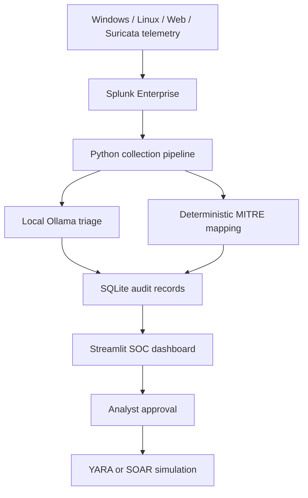

# AI-Augmented SOC Triage Platform

> Local AI-assisted SOC triage lab that enriches Splunk alerts with evidence, MITRE ATT&CK context, analyst notes, and approval-gated response workflows.

[](https://www.python.org/)
[](https://www.splunk.com/)
[](https://ollama.com/)
[](https://attack.mitre.org/)
[](LICENSE)

## Overview

This project explores how a local language model can assist SOC alert triage without giving the model authority to take action. Splunk collects endpoint, Linux, web, and network telemetry. A Python pipeline retrieves alerts, normalizes evidence, asks a local Ollama model for triage assistance, applies deterministic MITRE ATT&CK fallback mapping, and stores the investigation record in SQLite.

Response remains analyst-controlled. YARA quarantine and SOAR actions are gated by explicit approval and audit records.

## Engineering Goals

- Centralize lab telemetry from Windows, Linux, Apache, Suricata, and YARA sources.
- Convert Splunk alerts into structured incident records.
- Use local AI for severity, verdict, confidence, false-positive indicators, and next-step recommendations.
- Preserve raw evidence and deterministic mappings so AI output is reviewable.
- Keep containment and response actions approval-gated.
- Demonstrate a practical SOC workflow from telemetry to investigation to audit trail.

## Architecture




## Implemented Capabilities

| Area | Implementation |
| --- | --- |
| SIEM | Splunk Enterprise searches, dashboards, and alert collection |
| AI triage | Local Ollama model with structured verdict, severity, confidence, and analyst guidance |
| Evidence handling | Raw-event views, normalized fields, redaction helper, SQLite audit trail |
| MITRE mapping | Deterministic fallback mapping when model output is incomplete or unsupported |
| Detection sources | Windows Security, Sysmon, Defender, Linux auth/syslog, Apache, Suricata, YARA |
| Response workflow | Analyst notes, approval decisions, YARA scan/quarantine/restore records, SOAR simulation |
| Operations | Scheduled pipeline execution, `flock` protection, deferred processing for resource control |

## Validated Scenarios

| Data source | Scenario | Evidence-supported ATT&CK mapping |
| --- | --- | --- |
| Suricata | Network service discovery | `T1046` Network Service Discovery |
| Linux authentication | SSH password guessing | `T1110.001` Password Guessing |
| Apache / DVWA | Public-facing web exploitation attempts | `T1190` Exploit Public-Facing Application |
| PowerShell / Sysmon | Encoded PowerShell execution | `T1059.001` PowerShell |
| Sysmon process creation | LOLBin-style execution | `T1218` System Binary Proxy Execution |
| YARA | File-signature match | Evidence-dependent; no automatic technique claim |

Mappings are assigned only when supported by event evidence. Ordinary flow records are not presented as IDS detections unless an alert signature or validated correlation exists.

## Repository Structure

```text
AI-Augmented-SOC-Triage-Platform/
├── app/                    # Detection, AI triage, dashboard, database, and response code
├── Rules/                  # YARA laboratory rules
├── Splunk/                 # Splunk dashboard and supporting assets
├── docs/
│   ├── architecture/       # Architecture diagrams
│   ├── reports/            # Validation and incident reports
│   └── screenshots/        # Redacted evidence screenshots
├── requirements.txt
├── LICENSE
└── README.md
```

## Evidence and Reports

| Artifact | Purpose |
| --- | --- |
| `docs/architecture/ai-soc-architecture.svg` | System architecture and trust boundaries |
| `docs/reports/INC-2026-08-25-AI-SOC-Security-Validation-Report.md` | End-to-end validation report |
| `docs/reports/TEST-001_Network_Reconnaissance_Validation_Report.md` | Network reconnaissance validation example |
| `docs/screenshots/` | Redacted screenshots for telemetry, triage, MITRE, dashboard, and pipeline evidence |
| `Splunk/ai_soc_live_monitoring.xml` | Splunk dashboard source |
| `Rules/lab_test.yar` | Controlled YARA validation rule |

## Local Setup

### Prerequisites

- Ubuntu SOC server or VM
- Python 3.10+
- Splunk Enterprise
- Ollama with a local model
- Splunk Universal Forwarder on relevant endpoints
- Suricata and Sysmon where those telemetry sources are used

### Install

```bash
git clone https://github.com/Parakh-Shinde/AI-Augmented-SOC-Triage-Platform.git
cd AI-Augmented-SOC-Triage-Platform
python3 -m venv .venv
source .venv/bin/activate
pip install --upgrade pip
pip install -r requirements.txt
```

Prepare the local model:

```bash
ollama pull qwen2.5:1.5b
ollama ps
```

Create a local `.env` file and do not commit it:

```dotenv
OLLAMA_MODEL=qwen2.5:1.5b
SPLUNK_HOST=https://127.0.0.1:8089
SPLUNK_USERNAME=your_local_splunk_user
SPLUNK_PASSWORD=replace_me
```

Validate Python syntax:

```bash
python -m py_compile app/*.py
```

Start the dashboard:

```bash
python -m streamlit run app/dashboard.py \
  --server.address 0.0.0.0 \
  --server.port 8501 \
  --server.headless true
```

Run one collection cycle:

```bash
python -m app.splunk_pipeline
```

A healthy run should finish with `failed=0`. Deferred alerts are expected when the lab limits new work to protect local model resources.

## Required Splunk Indexes

```text
windows
linux
web
suricata
ai_triage
security_alerts
```

Freshness check:

```spl
(index=windows OR index=linux OR index=web OR index=suricata OR index=ai_triage)
earliest=-30m
| stats count latest(_time) AS last_seen BY index host source
| convert ctime(last_seen)
| sort 0 index host
```

## Safe Validation Examples

Run tests only against systems you own or are explicitly authorized to assess.

Bounded network discovery:

```bash
sudo nmap -sS -sV -T3 --top-ports 20 <LAB_TARGET_IP>
```

Harmless encoded PowerShell marker:

```powershell
$command = 'Write-Output "AI_SOC_ENCODED_TEST"'
$encoded = [Convert]::ToBase64String([Text.Encoding]::Unicode.GetBytes($command))
powershell.exe -NoProfile -EncodedCommand $encoded
```

## Security Design Choices

- Ollama runs locally; no third-party AI API is required for triage.
- AI output is treated as assistance, not a trusted decision.
- MITRE mapping falls back to deterministic logic when model output is incomplete.
- Sensitive fields can be redacted before storage or display.
- Containment workflows require analyst approval and create audit records.
- Pipeline limits and deferred processing protect resource-constrained lab systems.

## Limitations

- Built for an isolated VMware lab, not a production SOC.
- AI output may be incomplete or incorrect and must be reviewed.
- Response actions are simulated or restricted to controlled test files.
- Detection quality depends on telemetry coverage, field extraction, and rule tuning.
- Private RFC 1918 addresses cannot be geolocated on public maps.
- Resource-constrained systems may defer alerts across multiple cycles.
- Wazuh is not part of the current core deployment.

## Roadmap

- Add automated unit and schema tests.
- Add GitHub Actions for Python validation and secret scanning.
- Measure ingestion, detection, triage, and analyst-review latency.
- Expand ATT&CK coverage with evidence-backed tests.
- Add campaign-level correlation across endpoint, web, and network sources.
- Add optional Wazuh and Zeek integrations in separate lab modules.

## Responsible Use

This repository is for defensive security education, authorized testing, and isolated laboratory use. Do not use the testing procedures against systems without explicit permission. Never commit `.env`, passwords, tokens, private keys, live databases, quarantine contents, or unredacted logs.

## Author

**Parakh Shinde**  
SOC Engineering | Detection Engineering | Incident Response | AI-Assisted Security Automation

- Portfolio: [parakh-shinde.github.io](https://parakh-shinde.github.io/)
- GitHub: [Parakh-Shinde](https://github.com/Parakh-Shinde)
- LinkedIn: [parakh-shinde](https://www.linkedin.com/in/parakh-shinde/)

## License

This project is available under the [MIT License](LICENSE).
