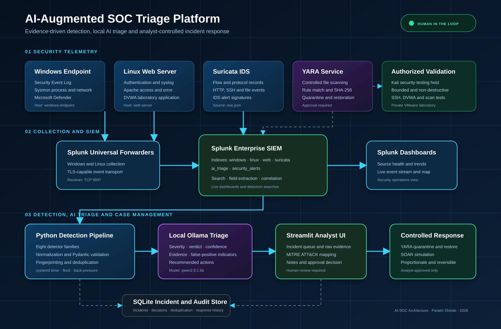

# AI-SOC Architecture

## Architectural Layers

1. **Security telemetry** — Windows, Linux, Apache, Suricata and YARA produce endpoint, authentication, web, network and file-analysis evidence.
2. **Collection and SIEM** — Splunk Universal Forwarders send host events to Splunk Enterprise. Suricata `eve.json` is monitored as network telemetry.
3. **Detection pipeline** — Python executes detector searches, normalizes multivalue fields, validates schemas, fingerprints events and prevents duplicate processing.
4. **Local AI triage** — Ollama generates structured severity, verdict, confidence, evidence and recommendations. Deterministic logic supports missing MITRE mappings.
5. **Analyst workspace** — Streamlit exposes prioritized incidents, raw evidence, ATT&CK mapping, notes and approval decisions.
6. **Controlled response** — YARA quarantine, restoration and SOAR simulation occur only after analyst authorization.
7. **Audit storage** — SQLite stores incidents, decisions, deduplication state and response history for the laboratory build.

## Security Boundaries

- Testing is restricted to the authorized private VMware laboratory.
- Ollama runs locally so alert content is not sent to a hosted AI API.
- Generative output is treated as analyst assistance, not trusted ground truth.
- Response actions are approval-gated and designed to be reversible.
- Event-processing limits and `flock` protect the resource-constrained SOC server.

