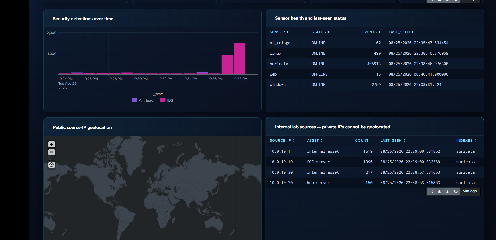
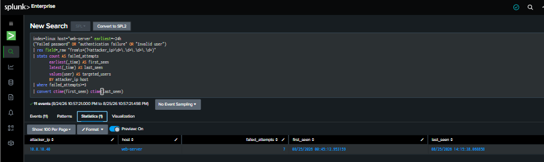
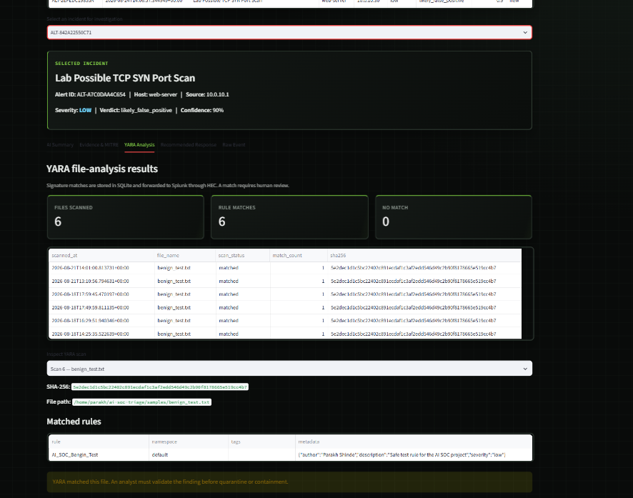

# AI-Augmented SOC Security Validation and Incident Report

## Document Control

| Field | Value |
|---|---|
| Report ID | `INC-2026-08-25-AI-SOC-01` |
| Project | AI-Augmented SOC Triage Platform |
| Report type | Consolidated detection, triage and operational-validation report |
| Environment | Authorized private VMware security laboratory |
| Report date | 25 August 2026 |
| Time zone | Asia/Kolkata (IST) |
| Prepared by | Parakh Shinde |
| Classification | Public portfolio version — laboratory evidence only |
| Overall status | **Partially Passed with corrective actions** |

> This report documents controlled security-validation activity performed only against systems owned by the project author. It does not claim that the laboratory is production-ready or formally compliant with ISO/IEC 27001 or NIST.

---

## 1. Executive Summary

The AI-Augmented SOC Triage Platform was evaluated across collection, detection, AI-assisted triage, MITRE ATT&CK mapping, YARA file analysis and scheduled pipeline operation.

The validation confirmed that:

- Windows, Linux, Suricata and AI-triage telemetry was visible in Splunk.
- Linux SSH password-guessing activity was detected and summarized by source address.
- Suricata events with populated alert signatures were searchable in Splunk.
- The AI dashboard created prioritized incidents with severity, verdict and confidence.
- A laboratory TCP SYN scan incident was mapped to `T1046 – Network Service Discovery`.
- The YARA service identified the benign laboratory test marker and stored SHA-256 evidence.
- Splunk, Ollama, the dashboard and the scheduled pipeline timer were active.
- The latest pipeline cycles completed successfully with `failed=0`.

Two evidence limitations were identified:

1. The telemetry-health screenshot showed the `web` source as `OFFLINE` because its last event was stale at capture time.
2. The YARA screenshot proved a signature match, but did not visibly prove analyst approval, quarantine or restoration.

The overall result is therefore **Partially Passed**. Core collection, detection, triage and automation worked, while evidence completeness and sensor-health presentation require improvement.

---

## 2. Scope and Authorization

### In-Scope Systems

| Asset | Role | Known laboratory address |
|---|---|---|
| SOC server | Splunk, Ollama, Streamlit, SQLite and automation | `10.0.10.10` |
| Web server | Ubuntu, Apache, DVWA and Suricata | `10.0.10.20` |
| Windows endpoint | Windows Security, Sysmon, Defender and Suricata telemetry | `10.0.10.30` |
| Validation source | Authorized testing host observed in SSH evidence | `10.0.10.40` |
| Additional internal source | Laboratory network asset shown in Suricata evidence | `10.0.10.1` |

### In-Scope Activities

- Controlled SSH password failures
- Bounded network scanning and Suricata validation
- AI-assisted alert triage
- MITRE ATT&CK mapping review
- Benign YARA signature validation
- Service, timer and pipeline-health verification

### Explicitly Excluded

- Public or third-party systems
- Destructive malware
- Credential theft
- Uncontrolled DoS or DDoS
- Persistent compromise
- Unapproved firewall or account changes

---

## 3. Evidence Register

| Evidence ID | Description | Repository file | Status |
|---|---|---|---|
| `EV-01` | Telemetry health, event trends and internal sources | `docs/screenshots/01-telemetry-health.png` | Included |
| `EV-02` | SSH password-guessing summary | `docs/screenshots/02-ssh-password-guessing-detection.png` | Included |
| `EV-03` | Confirmed Suricata alerts with signatures | `docs/screenshots/03-suricata-network-alert.png` | Included |
| `EV-04` | Splunk AI-SOC command center | `docs/screenshots/04-ai-soc-live-dashboard.png` | Included |
| `EV-05` | Ollama AI-triage dashboard | `docs/screenshots/05-ollama-ai-triage.png` | Included |
| `EV-06` | MITRE ATT&CK evidence view | `docs/screenshots/06-mitre-attack-evidence.png` | Included |
| `EV-07` | YARA file-analysis result | `docs/screenshots/07-yara-approved-quarantine.png` | Match proven; quarantine not visible |
| `EV-08` | Services, timer and pipeline logs | `docs/screenshots/08-automated-pipeline-health.png` | Included |
| `EV-09` | Live Suricata event stream | `docs/screenshots/09-live-security-event-stream.png` | Included |
| `EV-10` | Telemetry and authentication analytics | `docs/screenshots/10-authentication-source-analytics.png` | Included |

---

## 4. Platform Health Assessment

### Observed Sensor Status

| Sensor | Observed state | Evidence |
|---|---|---|
| `ai_triage` | Online | 62 events shown |
| `linux` | Online | 490 events shown |
| `suricata` | Online | 405,913 events shown |
| `windows` | Online | 2,759 events shown |
| `web` | Offline/stale | 15 events; last-seen time was stale |

### Assessment

The screenshot confirms active Windows, Linux, Suricata and AI-triage visibility. The public geolocation panel is empty because the displayed addresses are private RFC 1918 laboratory addresses and cannot be assigned meaningful public coordinates.

The `web` sensor being offline does not prove permanent forwarder failure. It indicates that no sufficiently recent web event was available at capture time. The source should be retested with a controlled Apache request and the health screenshot captured again.

### Status

**Partially Passed** — four sources online; one source stale.

---

## 5. Incident Case 1 — SSH Password Guessing

### Incident Summary

| Field | Observed value |
|---|---|
| Incident ID | `INC-SSH-2026-08-25-01` |
| Target | `web-server` |
| Source IP | `10.0.10.40` |
| Failed attempts | 7 |
| First seen | 25 August 2026, approximately 00:45:12 IST |
| Last seen | 25 August 2026, approximately 14:15:38 IST |
| Data source | `/var/log/auth.log` / `linux_secure` |
| ATT&CK mapping | `T1110.001 – Password Guessing` |
| Recommended severity | Medium in the lab; High if unauthorized and repeated in production |
| Disposition | Authorized laboratory activity |

### Detection Evidence

The Splunk search grouped failed SSH events by attacker IP and host, then required at least three failures. The result showed seven failed attempts against the web server from `10.0.10.40`.

### Analyst Assessment

The activity met the behavioral threshold for password guessing. Because the test was authorized and performed inside the laboratory, the correct portfolio disposition is **true detection / authorized simulation**, not a real compromise.

### Potential Business Impact

If the same pattern were unauthorized, successful credential guessing could lead to:

- Initial access to the web server
- Unauthorized command execution
- Credential abuse
- Persistence or lateral movement
- Loss of confidentiality, integrity or availability

### Recommended Production Response

1. Confirm whether the source belongs to an authorized administrator or scanner.
2. Review successful logins from the same source and account.
3. Check for new processes, files, users and persistence after the attempts.
4. Require key-based authentication and disable password login where possible.
5. Apply rate limiting or temporary blocking only after authorization.
6. Reset credentials if compromise is suspected.

### Validation Result

**Passed** — behavior detected, source extracted and threshold summarized.

---

## 6. Incident Case 2 — Suricata Network Alerts

### Incident Summary

| Field | Observed value |
|---|---|
| Incident ID | `INC-NET-2026-08-25-01` |
| Reporting host | `web-server` |
| Example source | `10.0.10.10` |
| Example destination | `10.0.10.1` |
| Data source | Suricata `eve.json` |
| Event type | `alert` |
| Example signatures | `SURICATA STREAM FIN out of window`, `SURICATA HTTP too many warnings`, `SURICATA HTTP Response excessive header repetition` |
| Disposition | Requires context; several alerts may be protocol anomalies or false positives |

### Detection Evidence

The Splunk search filtered for `event_type="alert"`, normalized the signature field and excluded blank signatures. The results prove that Suricata produced actual alerts rather than only flow or protocol records.

### Live Telemetry Evidence

The live event stream showed HTTP, anomaly, file-info and alert events arriving from `/var/log/suricata/eve.json` on the web server.

### Analyst Assessment

The signatures demonstrate network inspection and IDS alert ingestion. However, signatures such as stream-window anomalies and excessive header repetition do not automatically prove malicious activity. They require correlation with source ownership, request payload, frequency, target application and change history.

### Recommended Production Response

1. Confirm whether the source and destination are internal infrastructure.
2. Review the corresponding HTTP and flow records using the shared `flow_id`.
3. Inspect Apache logs for matching requests and status codes.
4. Baseline recurring protocol anomalies before raising severity.
5. Tune noisy signatures without suppressing high-confidence attack evidence.
6. Escalate only when payload, behavior and impact support malicious intent.

### Validation Result

**Passed for IDS ingestion; investigation required for incident classification.**

---

## 7. Incident Case 3 — AI Triage and MITRE ATT&CK Mapping

### Incident Summary

| Field | Observed value |
|---|---|
| Alert ID | `ALT-A7C0DAA4C654` |
| Detection | Lab Possible TCP SYN Port Scan |
| Host | `web-server` |
| Source | `10.0.10.1` |
| Severity | Low |
| Verdict | `likely_false_positive` |
| Confidence | 90% |
| ATT&CK technique | `T1046 – Network Service Discovery` |

### AI Dashboard Evidence

The dashboard showed live event volume, four active sensors, an AI-prioritized incident queue and a selected Suricata incident.

### ATT&CK Evidence

The selected TCP SYN scan incident was mapped to `T1046 – Network Service Discovery`. Both the supporting-evidence and false-positive sections stated that the activity represented a legitimate laboratory scan.

### Analyst Assessment

The platform correctly distinguished detection from malicious intent. A scan can satisfy the behavior associated with network service discovery while still being authorized. The ATT&CK mapping describes the observed technique; it does not by itself prove hostile intent.

The supporting-evidence wording should be improved in a future release because the same sentence appears under both supporting evidence and false-positive indicators. Supporting evidence should describe the packet or signature facts, while false-positive indicators should explain why the source was authorized.

### Validation Result

**Passed with content-quality improvement required.**

---

## 8. Incident Case 4 — YARA File Signature Match

### Incident Summary

| Field | Observed value |
|---|---|
| Incident ID | `INC-YARA-2026-08-25-01` |
| Test file | `benign_test.txt` |
| YARA rule | `AI_SOC_Benign_Test` |
| Scan status | Matched |
| Match count | 1 per displayed scan |
| Files scanned | 6 displayed records |
| Rule matches | 6 displayed records |
| No-match count | 0 |
| Test purpose | Controlled validation of file-analysis workflow |

### Detection Evidence

The YARA panel displayed the benign test file, its SHA-256 value and the `AI_SOC_Benign_Test` rule. The warning correctly stated that an analyst must validate the result before quarantine or containment.

### Analyst Assessment

The screenshot proves repeated signature matches and evidence storage. It does **not** visibly show:

- An analyst approval decision
- A quarantine destination
- A completed quarantine action
- A completed restoration action

The filename says “approved quarantine,” but the image itself proves only the analysis stage. The evidence classification in this report therefore remains limited to **YARA match validated**.

### Recommended Corrective Evidence

Capture an additional screenshot showing:

1. The YARA incident selected by alert ID.
2. Analyst approval notes.
3. The quarantine path.
4. Successful restoration status.

### Validation Result

**Detection passed; quarantine and restoration evidence incomplete.**

---

## 9. Automation and Pipeline Reliability

### Observed State

The health evidence showed:

- Splunk active
- Ollama active
- AI-SOC dashboard active
- Pipeline timer active
- A future scheduled execution time
- Twenty Suricata alerts matched in each displayed cycle
- Two incidents processed per cycle
- Eighteen incidents deferred by the resource-protection limit
- HEC success responses
- `failed=0`

### Assessment

The pipeline completed successfully and the deferred count behaved as designed. Deferral is not data loss; it is back-pressure that prevents Ollama and Splunk from exhausting the SOC server’s limited resources.

### Validation Result

**Passed** — services active, scheduling operational, HEC successful and pipeline failures equal to zero.

---

## 10. SOC Dashboard Assessment

The Splunk command center presented:

- Monitoring status
- Event volume
- High/critical AI incidents
- Active telemetry sources
- Failed authentication attempts
- Suricata alert count
- Security-detection trends
- Sensor-health status
- Internal source-IP analytics
- Live event stream
- Windows and Linux authentication activity

### Validation Result

**Passed with sensor-health warning** — dashboard functionality is proven, but the web source should be brought online before the final portfolio capture.

---

## 11. Consolidated Findings

| Finding ID | Finding | Severity | Status |
|---|---|---|---|
| `F-01` | SSH password-guessing activity detected and summarized | Medium | Passed / authorized test |
| `F-02` | Suricata alert signatures successfully ingested | Informational | Passed |
| `F-03` | AI incident mapped to MITRE `T1046` | Informational | Passed |
| `F-04` | AI evidence and false-positive text duplicated | Low | Improvement required |
| `F-05` | YARA benign test signature matched | Low | Passed |
| `F-06` | YARA approval, quarantine and restoration not visible | Medium evidence gap | Open |
| `F-07` | Web telemetry source stale/offline in health screenshot | Medium operational gap | Retest required |
| `F-08` | Automated pipeline completed with `failed=0` | Informational | Passed |
| `F-09` | Alert backlog handled through deferral | Informational | Working as designed |

---

## 12. MITRE ATT&CK Coverage

| Technique | Name | Supporting case | Confidence |
|---|---|---|---|
| `T1046` | Network Service Discovery | Laboratory TCP SYN scan | High for behavior; low for malicious intent |
| `T1110.001` | Password Guessing | Seven SSH authentication failures | High |
| `T1190` | Exploit Public-Facing Application | DVWA web-attack detector capability | Previously validated; not directly shown in this report |
| `T1059.001` | PowerShell | Encoded PowerShell detector capability | Previously validated; not directly shown in this report |
| `T1218` | System Binary Proxy Execution | LOLBin detector capability | Previously validated; not directly shown in this report |

ATT&CK mappings describe behavior. They must not be treated as proof that an activity was unauthorized or malicious.

---

## 13. Framework Alignment

| Framework | Relevant area | Evidence in this report |
|---|---|---|
| ISO/IEC 27001:2022 | A.8.15 Logging | Centralized Windows, Linux, Apache, Suricata and AI logs |
| ISO/IEC 27001:2022 | A.8.16 Monitoring activities | Source-health monitoring and detection analytics |
| ISO/IEC 27001:2022 | A.5.24–A.5.28 | Incident planning, assessment, response, learning and evidence |
| NIST CSF 2.0 | DE.CM and DE.AE | Continuous monitoring and event analysis |
| NIST CSF 2.0 | RS.AN and RS.MI | Investigation and analyst-controlled mitigation |
| NIST SP 800-61 | Detection and Analysis | Evidence validation and incident classification |
| NIST SP 800-61 | Containment, Recovery and Improvement | Approval-gated response and corrective actions |

This mapping demonstrates laboratory alignment only and is not a formal compliance assessment.

---

## 14. Corrective Action Plan

| Priority | Action | Owner | Acceptance criterion |
|---|---|---|---|
| P1 | Generate a controlled Apache request and restore web sensor freshness | Lab administrator | `web` displays `ONLINE` with a recent timestamp |
| P1 | Capture analyst approval, quarantine path and restoration status | SOC analyst | Evidence visibly proves the complete YARA response lifecycle |
| P2 | Separate AI supporting evidence from false-positive reasoning | Application developer | The two dashboard sections contain distinct, relevant text |
| P2 | Retake narrow dashboard screenshot at readable zoom | Project owner | Incident fields readable without magnification |
| P2 | Add raw Splunk exports or sanitized JSON for high-value tests | Project owner | Screenshot claims can be verified from machine-readable evidence |
| P3 | Measure ingestion, detection and triage latency | Project owner | Metrics recorded across repeated tests |
| P3 | Add automated schema, secret and documentation checks | Application developer | GitHub Actions pass on every change |

---

## 15. Final Conclusion

The validation proves that the project is more than a collection of installed tools. It demonstrates a connected security workflow across telemetry collection, Splunk detection, AI-assisted triage, ATT&CK enrichment, analyst investigation and scheduled automation.

The strongest validated outcomes are:

- Multi-source visibility
- SSH password-guessing detection
- Confirmed Suricata signature ingestion
- Local Ollama incident triage
- Evidence-supported MITRE mapping
- YARA signature detection
- Automated processing with `failed=0`

The remaining gaps are evidence quality rather than core platform failure. The web source must be refreshed, and the YARA response workflow requires a screenshot proving approval, quarantine and restoration.

**Final status: Partially Passed — core SOC workflow operational; corrective evidence required before full closure.**

---

## Responsible Use

All activity documented in this report was intended for an isolated, authorized laboratory. The techniques and searches must not be used against systems without explicit permission.

